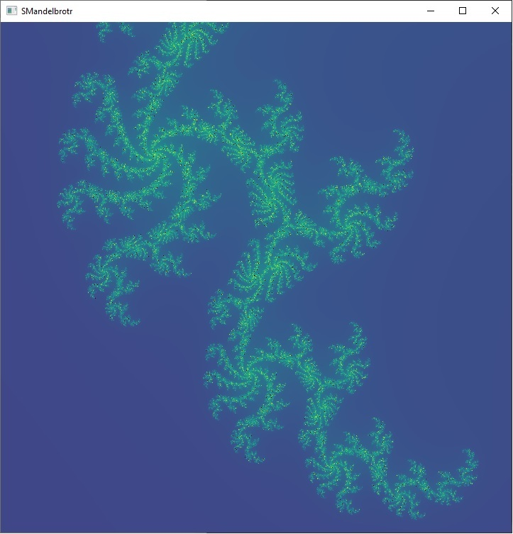

# SMandelbrotr

A [Mandelbrot set](https://en.wikipedia.org/wiki/Mandelbrot_set) pan/zoom application powered via [SDL2](https://www.libsdl.org/), [CUDA](https://developer.nvidia.com/cuda-zone), [OpenGL](https://www.opengl.org/) (via [GLEW](http://glew.sourceforge.net/) and [GLM](https://glm.g-truc.net/)) and [ImGUI](https://github.com/ocornut/imgui).  



## Building

Requires [Cmake](https://cmake.org/) 

### Windows

Tested to work with Visual Studio 2017 both Community & Enterprise editions with the CMake extras installed.

Originally derived from https://trenki2.github.io/blog/2017/06/02/using-sdl2-with-cmake/  (Thanks!)

Cmake now downloads SDL2, GLEW, GLM and IMGUI, so Visual Studio CMake build & Project build and you should be good.

### Linux

You'll need a more recent version of cmake than Ubuntu 16.04 comes with.  Google for how to install that.

`sudo apt-get install cmake libsdl2-dev libglew-dev`
then
```
mkdir Debug
cd Debug
cmake -DCMAKE_BUILD_TYPE=Debug ..
make
```
or
```
mkdir Release
cd Release
cmake -DCMAKE_BUILD_TYPE=Release ..
make
```

## Usage

An [NVIDIA](https://www.nvidia.com/) graphics card is required.  If you have a laptop with hybrid graphics, use the NVIDIA Control Panel's Manage 3D Settings panel and Program Settings tab to make Java choose the "High-performance NVIDIA processor".

Making the window smaller will speed up the calculations.

```
options:
  -d N    - select cuda device number N. (default = 0)
  -p PATH - path to shaders & compute kernel. (default = '.')
  -h      - this message.
```

To avoid setting commandline options, run this from the source directory like `./Release/smandelbrotr` 

### Mouse 

Left click to pan.
Middle scroll wheel to zoom.

### Key Bindings

* __ESC__: quit
* __TAB__: show/hide information window
* __d/s__: (d)ouble or (s)ingle floating point precision math.  Single is default.  It is faster & less precise.
* __f__: switch to/from (f)ullscreen.
* __enter__: begin zoom out mode.  animates un-zooming.
* __1/2/3/4__: allow for N times 256 levels for determining whether in/out of mandelbrot set.
* __p__: (p)rint out some state.
* __w__: (w)rite out current screen to "save.bmp" -- careful, it will overwrite existing files.

Enjoy the old-school keyboard shortcuts and lack of a real GUI, it builds character.

## License

Since I cobbled this code together basically by stringing existing example code together, I'll be giving this back to the community.

<p xmlns:dct="http://purl.org/dc/terms/" xmlns:vcard="http://www.w3.org/2001/vcard-rdf/3.0#">
  <a rel="license"
     href="http://creativecommons.org/publicdomain/zero/1.0/">
    
  </a>
  <br />
  To the extent possible under law,
  <a rel="dct:publisher"
     href="https://github.com/rogerallen/smandelbrotr">
    <span property="dct:title">Roger Allen</span></a>
  has waived all copyright and related or neighboring rights to
  <span property="dct:title">SMandelbrotr</span>.
This work is published from:
<span property="vcard:Country" datatype="dct:ISO3166"
      content="US" about="https://github.com/rogerallen/smandelbrotr">
  United States</span>.
</p>
